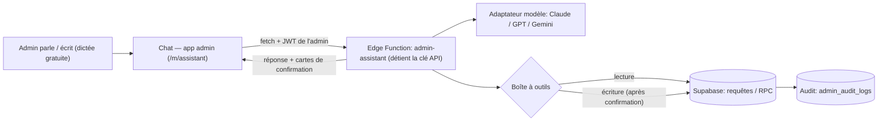

# Assistant Directeur des Opérations (DO) — Document de conception

> **Statut :** brouillon vivant — on le fait évoluer ensemble.
> **Dernière mise à jour :** 2026-05-31
> **Maquette visuelle :** [`maquette-assistant.html`](./maquette-assistant.html) (écran non fonctionnel, pour visualiser l'idée)

---

## 1. Résumé exécutif

On construit un **Directeur des Opérations IA** intégré à l'application admin de BonziniLabs.
Ce n'est **pas** un simple chatbot : c'est un **responsable des opérations** à qui un admin (au départ, le père du fondateur) parle ou écrit en langage naturel, et qui :

- **SAIT tout** sur la plateforme (volumes, statuts, soldes, clients, taux…) et répond à n'importe quelle question ;
- **AGIT** sur la plateforme (créer / modifier / annuler / archiver clients, dépôts, paiements, définir le taux du jour…), **avec confirmation humaine sur tout ce qui touche l'argent**.

Objectif : faire disparaître la saisie manuelle longue et pénible, pour des admins qui ont du mal avec l'app actuelle.

---

## 2. Vision & problème

**Le problème.** Aujourd'hui, pour chaque client (surtout ceux qui ne sont pas sur WhatsApp), un admin doit, à la main :
saisir le montant, le moyen, les détails → joindre la capture → valider le dépôt → créer le compte client → déclarer le paiement → mettre le QR code, etc.
C'est long, répétitif, et difficile pour un utilisateur non technique.

**La vision.** Un DO IA à qui on dit simplement *« nouvelle cliente Awa, elle a déposé 10M par Orange Money, elle veut payer 10M en Alipay »*, et qui enchaîne les opérations tout seul, en demandant uniquement ce qui manque, et en faisant confirmer d'un tap chaque mouvement d'argent.

**La portée voulue (mots du fondateur) :** *« peu importe la question, il répond ; peu importe l'action, il la fait. Il a accès à tout, à tous les modules. »*

---

## 3. Principes directeurs (non négociables)

1. **Confirmation humaine visuelle sur l'argent.** Toute action qui crédite/débite un wallet ou change le taux passe par une **carte de récap** validée d'un tap. Jamais d'exécution « argent » sur la voix seule.
2. **Tout est audité.** Chaque action d'écriture est journalisée (qui, quoi, quand, depuis quel message) via `admin_audit_logs`.
3. **L'assistant n'est jamais une porte dérobée.** Il agit **avec les permissions de l'admin connecté** — pas plus. (Respecte la règle « no super_admin bypass ».)
4. **Il ne s'autorise que ce que le statut permet.** Ex. on ne « modifie » pas un paiement déjà exécuté ; on l'inverse avec une trace.
5. **Il n'invente jamais.** Il déduit ce qu'il peut, lit ce que la base sait déjà, et **demande** le reste.
6. **Pas de suppression destructive en fintech.** « Supprimer » = **archiver** (clients) ou **annuler / inverser avec trace** (dépôts, paiements). Réversible et légal.
7. **Voix d'abord, gratuit d'abord.** On démarre avec la dictée native du téléphone (0 €, 0 code). Bouton micro intégré plus tard si besoin.
8. **Multi-modèle.** Architecture « prise universelle » : Claude au départ, mais on peut brancher GPT/Gemini sans réécriture.

---

## 4. Architecture

**Pièces principales :**

| Pièce | Rôle | Où |
|---|---|---|
| Écran chat | UI de conversation + cartes de confirmation | `src/mobile/screens/assistant/` (réutilise les composants `src/components/support/*`) |
| Edge Function `admin-assistant` | Le « cerveau » : boucle agentique, détient la clé API, vérifie l'admin, exécute les outils | `supabase/functions/admin-assistant/` |
| Adaptateur modèle | Abstraction multi-fournisseur (tool-calling + streaming) | dans l'edge function |
| Boîte à outils | Catalogue d'outils lecture/écriture mappés sur les RPC/requêtes existantes | dans l'edge function |
| Persistance | Conversations + messages (RLS admin) | tables `assistant_conversations`, `assistant_messages` |
| Audit | Trace des actions d'écriture | `admin_audit_logs` (existant) |

> ⚠️ **Important d'implémentation :** l'edge function est appelée depuis le front via `fetch()` avec le JWT de l'admin dans l'en-tête `Authorization` — **pas** via `supabaseAdmin.functions.invoke()` (qui échoue avec « Invalid JWT » à cause des conflits de session GoTrue). C'est le pattern déjà utilisé par les autres edge functions.

---

## 5. D'où viennent les informations

L'assistant ne combine que **3 sources**, jamais d'invention :

| | Source | Exemples |
|---|---|---|
| 🗣️ | **Ce que l'admin DIT** | montant, moyen de dépôt, nom du client, intention de paiement |
| 🗄️ | **Ce que la base SAIT déjà** | clients existants, soldes, bénéficiaires enregistrés, **taux du jour**, historique |
| ⚙️ | **Ce que le système fait seul** | référence `BZ-DP-…`, calcul du montant RMB, création du wallet |

Quand un champ **obligatoire** manque → l'assistant **relance**. Et avant toute action « argent », il affiche un **récap** à valider.

---

## 6. La voix (speech-to-text)

- ⚠️ **Claude ne fait pas de transcription audio.** Claude = texte + images. La voix vient toujours d'ailleurs.
- **Gratuit (point de départ) :** la **dictée native du clavier** iPhone/Android — l'admin appuie sur le 🎙️ du clavier et parle dans la zone de texte. 0 €, 0 code. (Le `Web Speech API` du navigateur est une autre option gratuite.)
- **Payant (plus tard, plus pro) :** bouton micro intégré → API STT (**Whisper** via OpenAI/Groq, **Deepgram Nova**, **ElevenLabs Scribe**). Meilleure précision FR + chiffres, voix qui répond possible.
- **Point sensible : les chiffres.** Une erreur de transcription sur un montant est neutralisée par la **carte de confirmation** (l'admin voit `10 000 000 XAF` et corrige avant de valider).

---

## 7. Les phases (par niveau de risque)

| Phase | Capacité | Risque | Exemple |
|---|---|---|---|
| **1** | **Il SAIT tout** — lecture + analytics + Q&A | Aucun (lecture seule) | *« Volume de la semaine ? »*, *« Où en est le paiement d'Awa ? »* |
| **2** | **Créations sûres** (avec confirmation) | Faible | Créer client, dépôt + validation, paiement |
| **3** | **Modifs, taux, annulations** | Moyen | Définir le taux du jour, corriger/annuler |
| **4** | **« Suppressions »** (archivage / inversion) | Élevé | Archiver un client, inverser un dépôt |

On livre **Phase 1 d'abord** : un DO qui répond à tout, rapide et sans risque. Puis on ajoute les pouvoirs d'action couche par couche, chacune avec revue de sécurité.

---

## 8. Catalogue des capacités (outils)

Chaque « outil » est mappé sur une requête ou une RPC **existante** et porte une **permission requise** (héritée de l'admin connecté).

### 8.1 Outils de LECTURE — Phase 1

| Outil | Fait quoi | Source code | Permission |
|---|---|---|---|
| `rechercher_clients(query)` | Trouver un client par nom/téléphone | table `clients` | `canViewClients` |
| `details_client(id)` | Fiche client + KYC | `clients` | `canViewClients` |
| `solde_wallet(client)` | Solde XAF | `wallets` (SELECT) | `canViewClients` |
| `lister_depots(filtres)` | Dépôts par statut/période/client | `deposits` / `useAdminDeposits` | `canViewDeposits` |
| `details_depot(id)` | Détail + timeline + preuves | `deposits`, `deposit_proofs` | `canViewDeposits` |
| `lister_paiements(filtres)` | Paiements par statut/période | `payments` | `canViewPayments` |
| `details_paiement(id)` | Détail paiement + bénéficiaire | `payments` | `canViewPayments` |
| `lister_beneficiaires(client, methode)` | Bénéficiaires enregistrés | `beneficiaries` / `useBeneficiaries` | `canViewPayments` |
| `taux_du_jour(methode?, pays?, montant?)` | Taux + calcul RMB | `daily_rates`, `calculate_final_rate` | `canViewPayments` |
| `resume_tresorerie()` | État trésorerie | module trésorerie | `canViewTreasury` |
| `statistiques(periode, dimension)` | Volumes, comptes, KPIs | dashboard stats | `canViewLogs` / `canViewDeposits` |
| `historique_audit(filtres)` | Journal des actions | `admin_audit_logs` | `canViewLogs` |

### 8.2 Outils d'ÉCRITURE — Phase 2 (créations sûres)

| Outil | RPC existante | Permission | Confirmation |
|---|---|---|---|
| `creer_client(...)` | `admin_create_client` | `canEditClients` *(à confirmer)* | Récap |
| `creer_depot(...)` | `create_client_deposit` | `canProcessDeposits` | Récap |
| `valider_depot(...)` | `validate_deposit` (preuve **optionnelle**) | `canProcessDeposits` | Récap **argent** |
| `creer_paiement(...)` | `create_payment` (atomique, `FOR UPDATE`) | `canProcessPayments` | Récap **argent** |
| `completer_paiement(...)` | `update_payment_beneficiary` | `canProcessPayments` | Récap |
| `attacher_capture(cible, fichier)` | upload bucket `deposit-proofs` / `payment-proofs` + `submit_deposit_proof` | `canProcessDeposits/Payments` | — |

### 8.3 Outils SENSIBLES — Phase 3

| Outil | RPC / mécanisme | Permission | Garde-fou |
|---|---|---|---|
| `modifier_client(...)` | UPDATE `clients` | `canEditClients` | Récap + audit |
| `rejeter_depot(...)` | `reject_deposit` | `canProcessDeposits` | Récap + raison |
| `annuler_paiement(...)` | flux `cancelled_by_admin` | `canProcessPayments` | **Statut-aware** (cf. §10) |
| `definir_taux_du_jour(...)` | `create_daily_rates` (désactive l'ancien) | `canManageRates` | **Confirmation forte** (impacte tous les clients) |

### 8.4 Outils À HAUT RISQUE — Phase 4

| Outil | Mécanisme | Permission | Garde-fou |
|---|---|---|---|
| `archiver_client(...)` | soft-delete (`status`) | `super_admin` | Confirmation forte + audit |
| `inverser_depot(...)` | écriture comptable compensatoire (**nouvelle RPC à concevoir**) | `super_admin` | Confirmation forte + audit |

---

## 9. Sécurité & conformité

- **Héritage de permissions :** chaque outil vérifie la permission de l'admin connecté **avant** exécution. L'assistant ne peut rien faire que l'admin ne pourrait faire lui-même.
- **Plafond montant :** 50 000 000 XAF (déjà appliqué dans les RPC). Vérif `Number.isSafeInteger`.
- **Anti double-dépense :** `SELECT … FOR UPDATE` sur le wallet (déjà dans `create_payment` / `validate_deposit`).
- **Pas de hard-delete :** archivage / inversion uniquement.
- **Taux du jour :** rayon d'impact énorme → confirmation forte, idéalement réservé à `super_admin`.
- **Idempotence :** clé d'idempotence par action pour éviter les doublons en cas de réessai réseau.
- **Confidentialité :** les conversations contiennent des données financières → RLS admin strict + politique de rétention.
- **Anti-« hallucination » :** l'assistant ne peut appeler **que** les outils déclarés (pas d'invention d'opération), et jamais d'action argent sans confirmation.
- **Revue de sécurité obligatoire** avant de livrer chaque lot d'écriture (Phases 2-4). Checklist OWASP (injection, accès non autorisé, mass assignment…).

---

## 10. Cas limites (et réponses)

- **Corriger un paiement après validation.** Statut-aware : argent pas encore parti → annulation + recréation (réversible) ; argent déjà parti (`completed`) → **irréversible**, on enregistre un ajustement/remboursement tracé, **validation humaine explicite** (pas d'auto).
- **Multilingue / mélange de langues.** Le cerveau (Claude) gère le code-switching et répond en français. Maillon fragile = la transcription, pas l'IA → français par défaut, filet = carte de confirmation. Noms propres toujours éditables.
- **La voix se trompe sur un montant.** Défense en couches : carte de confirmation (il voit le montant), relecture (« dix millions = 10 000 000 XAF ? »), contrôle de plausibilité, édition rapide, plafond 50M.
- **Historique des conversations.** Conservé (audit/conformité) : transcript + actions reliées au message déclencheur. Permet de reprendre un flux interrompu.
- **Flux interrompu / repris.** *« Tu avais un dépôt en cours pour Awa, on continue ? »*
- **Panne réseau en plein milieu.** Idempotence → pas de double création.
- **Échec partiel** (client créé mais dépôt échoué). Rapport clair, pas d'état bancal silencieux.
- **Deux admins en même temps** sur le même wallet. Verrous DB déjà en place ; l'assistant montre l'état à jour.
- **Désambiguïsation client** (deux « Awa »). L'assistant propose et fait choisir.

---

## 11. Multi-modèle (adaptateur)

- Interface `LLMProvider` (ex. `chat(messages, tools, { stream })`) avec implémentations par fournisseur.
- **Démarrage : Claude (Anthropic).** Ajout ultérieur de `OpenAIProvider`, `GeminiProvider` = nouvelle classe + clé, sans toucher au reste.
- Chaque fournisseur = sa propre clé (secret edge function) + sa propre facture.
- Alternative « une clé pour tout » : OpenRouter — écartée pour le fintech (données via un intermédiaire).

---

## 12. Coûts

- **Développement :** couvert par l'abonnement Claude Code Max du fondateur (gratuit côté build).
- **Exécution :** clé API Anthropic en **pay-as-you-go**. Modèle économique (Haiku/Sonnet) → ordre de grandeur **quelques centimes par opération**. Optimisations : prompt caching, budgets de tokens, choix du modèle selon la tâche.
- **STT :** gratuit au départ (dictée native). Payant seulement si bouton micro intégré.

---

## 13. Décisions

**Prises :**
- ✅ Fournisseur de départ : **Claude (Anthropic)**, via clé API (pas l'abonnement Max).
- ✅ Architecture **multi-modèle** (adaptateur) dès le départ.
- ✅ Voix : **dictée native gratuite** d'abord.
- ✅ Ordre : **Phase 1 (lecture) d'abord**.

**Ouvertes :**
- ⏳ Niveau de confirmation sur l'argent : confirmer **chaque** action / au-delà d'un **seuil** / mains libres. *(Recommandé : chaque action.)*
- ⏳ Permission exacte pour `creer_client` (`canEditClients` ou dédiée).
- ⏳ Modèle précis (Haiku vs Sonnet) selon coût/qualité observés.
- ⏳ Quand introduire le bouton micro intégré (et quel STT).

---

## 14. Références code (ancrage)

- **Routing admin :** `src/App.tsx` (routes `/m/*`, `MobileRouteWrapper`, `ProtectedAdminRoute`).
- **Navigation :** `src/mobile/components/layout/MobileTabBar.tsx`, `src/mobile/screens/more/MobileMoreScreen.tsx`.
- **Permissions :** `src/contexts/AdminAuthContext.tsx` (`hasPermission`, rôles).
- **Chat (à réutiliser) :** `src/components/support/*`, `src/types/chat.ts`, `src/hooks/useAdminChat.ts`.
- **Clients :** `src/hooks/useClientManagement.ts` → RPC `admin_create_client`.
- **Dépôts :** `src/hooks/useAdminDeposits.ts` → `create_client_deposit`, `validate_deposit`, `reject_deposit`, `submit_deposit_proof`.
- **Paiements :** `src/hooks/usePayments.ts` → `create_payment`, `update_payment_beneficiary`.
- **Bénéficiaires :** `src/hooks/useBeneficiaries.ts` (table `beneficiaries`).
- **Taux :** `daily_rates`, `rate_adjustments`, `calculate_final_rate`, `create_daily_rates` ; `src/components/payment-form/paymentRateLogic.ts`.
- **Edge functions (pattern) :** `supabase/functions/*` (appel via `fetch` + headers, secrets Supabase).
- **Audit :** table `admin_audit_logs`.
